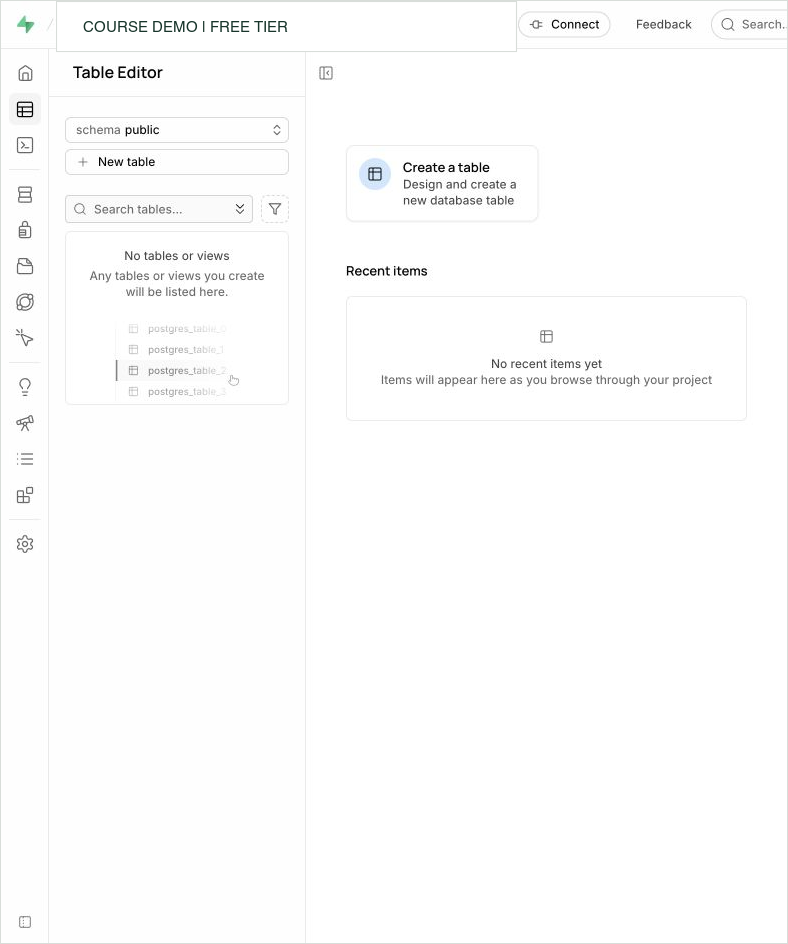

# Metro Support Dataset

Metro Support is a fictional public-service help desk used throughout the course.
The dataset is intentionally small enough to inspect by eye but rich enough to
practice relationships, integrity, concurrency, security, indexing, JSON,
document modeling, aggregation, and recovery.

## Files

- `users.csv`: people who submit or handle tickets.
- `tickets.csv`: one row per support request.
- `ticket_events.csv`: status changes and notes over time.
- [postgres_setup.sql](postgres_setup.sql): creates the PostgreSQL tables, their
  starting rules, and all sample rows. Use this file for Weeks 3 and 4; you do not
  need to import the three CSVs separately.

## First PostgreSQL Session

Week 2 used DuckDB to practice SQL without a server. Weeks 3 and 4 use PostgreSQL
because we are studying its stored definitions, constraints, views, and identity
columns. Use **one** of the following environments, then follow the shared
loading instructions below. This setup is part of the lab, not another submission.

### Supabase SQL Editor

Supabase hosts a PostgreSQL database for each project. Your browser's SQL Editor
sends statements to that database and displays its response. Closing the editor
does not remove committed tables or rows.

1. Open the [Supabase dashboard](https://supabase.com/dashboard). Use a personal
   course-practice project, or create one in an organization on the **Free** plan.
   Name it something recognizable, such as `cst4714-practice`, and select a nearby
   region. Keep its database password private; it is different from your
   dashboard login. Wait for the database to finish starting.
2. In that project, open **SQL Editor** and create a new query. You do not need
   Python, a connection string, an API key, or an IP allowlist for this dashboard
   exercise. Native database connections come later.
3. Paste this first statement into the editor and choose **Run**:

```sql
SELECT 2 + 3 AS sum, current_database() AS database_name;
```

The result contains one row with `sum = 5`. `AS` labels an output column;
`current_database()` asks the server which database answered. This calculation
does not create a table. It checks that you can submit SQL and read a result.

If Supabase offers only a paid option or says you have no free project available,
use the browser option below. Do not upgrade or delete another project's work
for this lab. You do not need to enable public API access to the course schema.

### Browser PostgreSQL Without an Account

Open the [PGlite Playground](https://pglite.dev/repl/). PGlite runs PostgreSQL
inside the browser. Wait for the empty SQL prompt at the bottom, paste the same
first statement above, and press **Enter** to execute it. Leave extension
settings unchanged. Paste complete multiline blocks into that prompt, then press
Enter once. Results appear above the prompt.

This option supports our Weeks 3 and 4 exercises. Its database is stored in this
browser's local storage, not in a Supabase project. Return using the same browser
profile and keep your SQL file outside the page. Clearing site data, using a
different profile, or choosing **Clear Playground Database** can remove your
practice state. Browser storage is not a backup or a submission.

Later work with independent server sessions, Supabase Auth, cloud connections,
and recovery has its own environment instructions. Do not substitute this
playground for those lessons. See [PGlite's explanation](https://pglite.dev/docs/about)
of its browser PostgreSQL implementation.

### Load the Course Tables Once

**The setup file is a reset, not a connection command.** Its opening
`DROP SCHEMA ... CASCADE` removes the existing `metro_support` schema and objects
that depend on it, potentially including objects in other schemas. Use a
dedicated practice environment with no work you need to keep. Do not rerun it
between the Week 4 labs; the second lab uses the first lab's view.

1. Open [postgres_setup.sql](postgres_setup.sql). On GitHub, use **Raw** to see
   just the SQL. Copy the entire file, including its final count query. The
   triple backticks surrounding examples in Markdown are not part of SQL.
2. Paste it into a new Supabase SQL query and run the complete script, or paste
   it at the PGlite prompt and press Enter. If the editor warns about destructive
   SQL, reread the reset warning above and confirm the target is disposable
   before proceeding.
3. Find the final count result. Expect **users: 8**, **tickets: 12**, and
   **ticket_events: 21**. In PGlite, earlier commands can display `null` because
   they return no result table; the final count query should still show rows.

The order in the file has a reason. `CREATE SCHEMA` names a container.
`CREATE TABLE` defines columns and rules. The inserts create users before
tickets, and tickets before events, so each referenced row already exists.
`SET search_path` lets that setup use short names such as `users`. Our later
queries spell out `metro_support.users` so another editor session can find the
intended table without inheriting that setting.

Run subsequent exercises in a **new query**, away from the reset script. Where
a lab says to run `BEGIN` through `ROLLBACK` together, select that whole block
and execute it once. Run deliberate failures separately. Keep the statements
you write in the one `.sql` file named by the lab.

### Find and Read the Data

```sql
SELECT ticket_id, status, assignee_id
FROM metro_support.tickets
ORDER BY ticket_id
LIMIT 4;
```

| ticket_id | status | assignee_id |
|---:|---|---:|
| 1001 | open | 201 |
| 1002 | in_progress | 202 |
| 1003 | resolved | 201 |
| 1004 | new | NULL |

The first part of `metro_support.tickets` names the schema. The second names the
table. `ORDER BY` determines which rows come first; `LIMIT 4` displays only four
of the twelve stored tickets. The missing assignee for 1004 represents a request
that has not yet been assigned.

In Supabase **Table Editor**, change the schema selector from `public` to
`metro_support`, then open `tickets`. An empty `public` list does not mean the
whole database is empty. The screenshot shows where to find this selector;
it predates your loaded tables.



### When the Result Is Unexpected

| What you see | What it means and what to do |
|---|---|
| `relation "tickets" does not exist` | Try the qualified name `metro_support.tickets`. A new SQL Editor request may not use the setup's search path. |
| `relation "metro_support.tickets" does not exist` | Check the selected project and whether the whole setup succeeded there. Opening a SQL file does not execute it. |
| `syntax error` near a backtick or a heading | Paste SQL only, without Markdown fences or surrounding prose. Read the first reported error. |
| A count or `SELECT` returns zero rows | The query ran. Check its filter and the starting data rather than treating an empty result as a broken connection. |
| `violates ... constraint` | The server reached the table and rejected a proposed value. Read the named rule and compare it with the value, especially during the lab's expected-failure test. |
| `current transaction is aborted` | An earlier statement failed inside a transaction. Run `ROLLBACK;` by itself, correct the earlier error, and retry the intended block. |

For the provider's explanation of the two editors, see
[Supabase's database overview](https://supabase.com/docs/guides/database/overview).

## Relationships

- `tickets.requester_id` refers to `users.user_id`.
- `tickets.assignee_id` may refer to a staff user or be empty.
- `ticket_events.ticket_id` refers to `tickets.ticket_id`.
- `ticket_events.actor_id` refers to `users.user_id`.

## Intentional Design Questions

- Should `status` and `priority` accept arbitrary text?
- Should a deleted user remove historical tickets?
- Which queries need an index?
- Who may read internal event details?
- In MongoDB, should events be embedded in a ticket or referenced separately?

## License

This is original synthetic data. It contains no real personal information and is
released under CC0 1.0.
